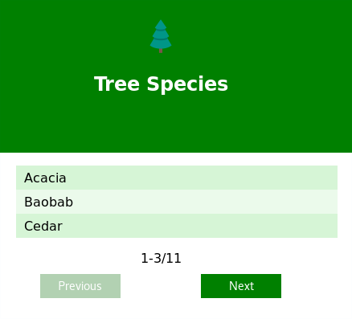

# Tree Species
A small app that let you see a list of tree species saved in a database.



# Prepare the App

## Database

### Create the database and a user
```bash
# In mysql console
CREATE database <db_name>;
# If you want a new user
CREATE USER <username> IDENTIFIED BY '<password>';
# Give access to the database for the user
GRANT ALL PRIVILEGES ON <db_name>.* TO '<username>';
```

### Fill it manually (Optional)
```bash
# Do this only if don't want the server to do it for you
Use <db_name>;
CREATE TABLE IF NOT EXISTS tree_species( id INTEGER PRIMARY KEY NOT NULL AUTO_INCREMENT, species TEXT);
INSERT INTO tree_species (species) VALUES ("Acacia"), ("Baobab"), ("Cedar"), ("Cypress"), ("Plantanus"), ("Olive Tree"), ("Oak"), ("Pine"), ("Sequoia"), ("Maple"), ("Elm");
```

### config.js
```bash
# In tree-species/
cp config.js.example config.js
# Replace the values with the one you have configured in MySQL
```

## Client

### Build (necessary)
```bash
# From tree-species/client
# Create the front end files the server will provide (necessary)
# Build in tree-species/client/build
# Install the react-app dependencies first /!\
npm install package.json
npm run build
```

### Development (only)
```bash
# From tree-species/client
# Proxy is bind to localhost:3000 (see package.json)
# The API server has to be launched aside (on port 3000)
npm start
```

# Run the app
```bash
# For custom port
export PORT=3000
# For allowing DB creation from the server set to 1 else set to 0
# Create the table if don't exist
# Remove the previous values and add the template ones
export CREATE_DB=1
node tree-species/bin/www
```

# Dependencies 
 - Node
 - Express
 - MySQL
 - React
 
